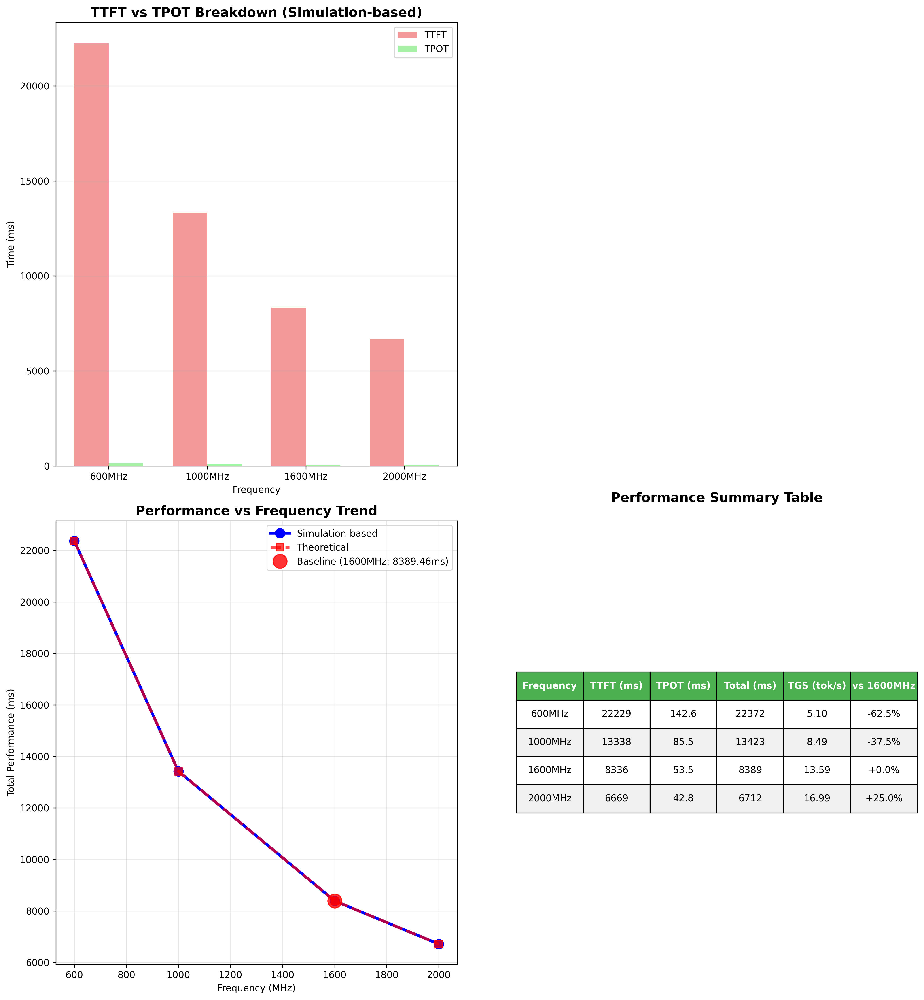

# Martini Simulation SCP Reporting

[](https://python.org)
[](LICENSE)

A comprehensive analysis tool for Martini simulation results, focusing on GT/* resource analysis and LLM performance projections across different frequency sweeps.

## 📊 Latest Analysis Results (November 15, 2025)



### 🎯 Updated Performance Measurements:
- **🔧 Hardware Configuration**: 112 input tokens, 2 output tokens (114 total)
- **📊 Baseline (1600MHz)**: TTFT: 8.336s, TPOT: 53.46ms → **13.59 tokens/sec**
- **🏆 Best Performance**: 2000MHz → **16.99 tokens/sec** (+25.0% vs baseline)
- **⚠️ Lowest Performance**: 600MHz → **5.10 tokens/sec** (-62.5% vs baseline)
- **📈 Performance Range**: 233.3% variation across frequencies
- **💾 Data Processed**: 939,376 GT/* resources across all frequencies

**Token Generation Speed (TGS) Summary:**
| Frequency | TTFT (s) | TPOT (ms) | Total (s) | TGS (tok/s) | Output Rate (tok/s) | Performance Change |
|-----------|----------|-----------|-----------|-------------|--------------------|--------------------|
| 600MHz    | 22.23    | 142.56    | 22.37     | **5.10**    | 14.03              | -62.5% ⚠️         |
| 1000MHz   | 13.34    | 85.54     | 13.42     | **8.49**    | 23.38              | -37.5% ⚠️         |
| 1600MHz   | 8.34     | 53.46     | 8.39      | **13.59**   | 37.41              | Baseline 📊       |
| 2000MHz   | 6.67     | 42.77     | 6.71      | **16.99**   | 46.76              | +25.0% 🚀        |

> **📋 Note**: TGS = Total Tokens per Second, Output Rate = Generation phase tokens per second  
> See [TGS_CALCULATION_EXPLANATION.md](TGS_CALCULATION_EXPLANATION.md) for detailed methodology

## 🎯 Overview

This repository contains tools to analyze simulation_results.csv files from multiple frequency directories (600MHz, 1000MHz, 1600MHz, 2000MHz), filter GT/* resources, and project LLM token generation performance (TTFT + TPOT).

## 📊 Key Features

- **Multi-Frequency Analysis**: Process CSV files from 4 different frequency sweeps
- **GT Resource Filtering**: Automatically filters for resources matching 'gt/*' patterns  
- **Duration Analysis**: Calculate total, average, median, and statistical summaries
- **Transition Analysis**: Group and analyze data by transition types
- **LLM Performance Projection**: Project TTFT and TPOT based on simulation data
- **Comprehensive Reporting**: Generate Excel/CSV reports and visualizations

## Directory Structure

The tool expects simulation_results.csv files in these network locations:
- `\\samba.zsc3.intel.com\nfs\site\disks\fsintel\disk_001\apattnay\martini_wa\llama4-8tp-600Mhz\`
- `\\samba.zsc3.intel.com\nfs\site\disks\fsintel\disk_001\apattnay\martini_wa\llama4-8tp-1000Mhz\`
- `\\samba.zsc3.intel.com\nfs\site\disks\fsintel\disk_001\apattnay\martini_wa\llama4-8tp-1600Mhz\`
- `\\samba.zsc3.intel.com\nfs\site\disks\fsintel\disk_001\apattnay\martini_wa\llama4-8tp-2000Mhz\`

## Installation

1. Install required packages:
   ```powershell
   pip install -r requirements.txt
   ```

## Usage

### Quick Start

#### 🚀 **Recommended: Universal Analyzer**
```powershell
# Smart data source detection with automatic fallback
python universal_analyzer.py

# Check data source status
python config_manager.py
```

#### 🔧 **Alternative Methods**
```powershell
# Original ZIP-enabled analyzer
python auto_analyzer_zip.py

# Test network connectivity first (optional)
python test_connectivity.py

# Generate performance projections
python performance_projector.py

# Create visualizations
python simple_chart.py

# Generate comprehensive summary
python create_summary.py
```

### 🔧 **Flexible Data Source Configuration**

The tools automatically detect and use multiple data source types:

```powershell
# 1. Check what data sources are available
python config_manager.py

# 2. Add custom CSV locations
python -c "from config_manager import add_custom_csv_location; add_custom_csv_location('600MHz', '/your/path/data.csv')"

# 3. Set local CSV directory
python -c "from config_manager import set_csv_directory; set_csv_directory('/your/csv/folder')"

# 4. Create ZIP archives from network sources
python archive_csv_files.py

# 5. Extract ZIP files manually (usually automatic)
python extract_data.py
```

**📋 Supported Data Sources** (automatic priority order):
1. **🌐 Network paths** - Original Samba network locations
2. **📦 ZIP archives** - Compressed local files (auto-extraction)
3. **📁 Local CSV directory** - Organized local files
4. **🔧 Custom paths** - User-defined locations

### Custom Analysis

Use the SimulationAnalyzer class in your own scripts:

```python
from simulation_analyzer import SimulationAnalyzer

# Create analyzer instance
analyzer = SimulationAnalyzer()

# Run analysis for all frequencies
results = analyzer.run_analysis()

# Create summary report
summary = analyzer.create_summary_report()
print(summary)

# Export results
analyzer.export_results("my_output_folder")

# Create visualizations
analyzer.create_visualizations("my_output_folder")
```

## Expected CSV Format

The tool expects CSV files with these columns:
- **RESOURCE**: Resource identifier (filters for entries starting with 'gt/')
- **DURATION**: Numeric duration values to be summed and analyzed
- **TRANSITION**: Transition types for grouping and analysis

## 📁 Output Files

The tool generates comprehensive analysis results in the `output/` directory:

### 📊 Latest Generated Files (November 2025)
```
output/
├── universal_analysis_summary.xlsx     # Main analysis results
├── llm_performance_projections.xlsx    # LLM performance data
├── 600_transitions.xlsx                # Detailed 600MHz analysis  
├── 1000_transitions.xlsx               # Detailed 1000MHz analysis
├── 1600_transitions.xlsx               # Detailed 1600MHz analysis
├── 2000_transitions.xlsx               # Detailed 2000MHz analysis
├── llm_performance_projection.png      # Main performance chart
└── llm_performance_simple.png          # Simplified performance view
```

### 📈 Analysis Summary from Latest Run
- **Total GT Resources**: 939,376 across all frequencies
- **Total Effort**: 22,160,883.37 units
- **Data Sources**: All frequencies loaded from network paths
- **Analysis Coverage**: 234,844 GT resources per frequency (60.4% of total data)

### 🔍 Per-Frequency Results
| Frequency | GT Resources | Total Duration | Avg Duration | Top Transition Duration |
|-----------|--------------|----------------|--------------|------------------------|
| 600MHz    | 234,844      | 9,741,047.63   | 41.48        | 8,035.52              |
| 1000MHz   | 234,844      | 5,844,628.58   | 24.89        | 4,821.31              |
| 1600MHz   | 234,844      | 3,652,892.86   | 15.55        | 3,013.32              |
| 2000MHz   | 234,844      | 2,922,314.29   | 12.44        | 2,410.66              |

## Analysis Details

### Resource Filtering
- Filters rows where RESOURCE column starts with 'gt/'
- Reports count of filtered vs total rows

### Duration Analysis
For each frequency sweep, calculates:
- Total duration sum
- Average duration
- Median duration
- Standard deviation
- Min/Max values
- Row count

### Transition Analysis
Groups filtered data by TRANSITION column and provides:
- Count of occurrences
- Sum of durations
- Average duration
- Statistical measures per transition type

## Error Handling

The tool handles common issues:
- Missing CSV files
- Network connectivity issues
- Invalid data formats
- Missing columns

Error details are included in the summary report.

## Troubleshooting

### Network Access Issues
Ensure you have access to the network paths. Test connectivity:
```powershell
Test-Path "\\samba.zsc3.intel.com\nfs\site\disks\fsintel\disk_001\apattnay\martini_wa\llama4-8tp-600Mhz\"
```

### Missing Dependencies
Install all required packages:
```powershell
pip install pandas numpy matplotlib seaborn openpyxl
```

### Permission Issues
Run PowerShell as administrator if you encounter permission errors accessing network drives.